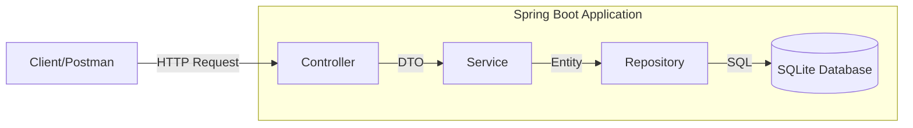

# Lab 1: Khởi Tạo & Kiến Trúc Hệ Thống

## Mục Tiêu
*   Hiểu bài toán và kiến trúc hệ thống (MVC / Layered Architecture).
*   Khởi tạo project Spring Boot.
*   Cấu hình kết nối cơ sở dữ liệu (SQLite).

## 1. Giới Thiệu Chuyên Đề
Chúng ta sẽ xây dựng **Student Management System** - một ứng dụng quản lý sinh viên đơn giản.
Trong chuỗi bài thực hành này, các bạn sẽ đóng vai Fullstack Developer để xây dựng từ Backend (API) đến Database và một phần Frontend đơn giản.

### Kiến Trúc Hệ Thống (Layered Architecture)
Chúng ta sẽ áp dụng mô hình kiến trúc phân lớp (Layered Architecture) - mô hình tiêu chuẩn trong phát triển Spring Boot. Đây là sự cụ thể hóa của tư duy MVC cho Backend API.

**Mô hình luồng dữ liệu:**


**Chi tiết các tầng:**
1.  **Controller Layer (Presentation)**:
    -   Đóng vai trò là cửa ngõ (Gateway) của ứng dụng.
    -   Tiếp nhận các HTTP Request (GET, POST, PUT, DELETE).
    -   Validate sơ bộ input từ người dùng.
    -   Gọi xuống Service để xử lý và trả về Response (JSON).
2.  **Service Layer (Business Logic)**:
    -   Chứa toàn bộ logic nghiệp vụ cốt lõi (Core Business).
    -   Ví dụ: Kiểm tra tuổi sinh viên > 0, kiểm tra email trùng lặp.
    -   Là cầu nối giữa Controller và Repository.
3.  **Repository Layer (Data Access)**:
    -   Giao tiếp trực tiếp với Database.
    -   Thực hiện các câu lệnh truy vấn (SELECT, INSERT, UPDATE, DELETE).
    -   Trong Spring Data JPA, tầng này thường là các Interface.
4.  **Database**:
    -   Nơi lưu trữ dữ liệu vật lý (File .db của SQLite hoặc Server PostgreSQL).

### Giới Thiệu Công Nghệ

**1. Java**
Là ngôn ngữ lập trình hướng đối tượng, mạnh mẽ và độc lập nền tảng (Write Once, Run Anywhere). Trong bài lab này, chúng ta sử dụng Java để viết logic xử lý cho Backend.

**2. Spring Boot**
Là một framework được xây dựng trên nền tảng Spring, giúp đơn giản hóa việc phát triển ứng dụng Java.
-   **Stand-alone**: Có thể chạy độc lập với Embedded Server (Tomcat) tích hợp sẵn.
-   **Opinionated**: Cung cấp các cấu hình mặc định hợp lý (Convention over Configuration), giúp developer tập trung vào code logic thay vì mất thời gian config.
-   **Production-ready**: Tích hợp sẵn các công cụ monitoring, health check.

**3. Maven**
Là công cụ quản lý dự án (Project Management) và tự động hóa quy trình build (Build Automation).
-   **Dependency Management**: Quản lý các thư viện (như Spring Web, SQLite) thông qua file `pom.xml`. Tự động tải về thay vì phải copy thủ công.
-   **Standard Directory Layout**: Định nghĩa cấu trúc thư mục chuẩn cho project Java.


## 2. Khởi Tạo Project (Chi Tiết)

Chúng ta sẽ sử dụng công cụ **Spring Initializr** để tạo khung project chuẩn.

**Bước 2.1:** Truy cập [https://start.spring.io/](https://start.spring.io/)

**Bước 2.2:** Cấu hình các thông số sau:
*   **Project**: Chọn `Maven` (Công cụ quản lý thư viện phổ biến).
*   **Language**: Chọn `Java`.
*   **Spring Boot**: Chọn `4.0.2` (hoặc phiên bản ổn định mới nhất không có chữ SNAPSHOT).

**Bước 2.3:** Điền thông tin **Project Metadata**:
*   **Group**: `vn.edu.hcmut.cse.adsoftweng` (Tên tổ chức/trường).
*   **Artifact**: `student-management` (Tên project).
*   **Name**: `StudentManagement`.
*   **Package name**: `vn.edu.hcmut.cse.adsoftweng.lab` (Package gốc chứa code).
*   **Packaging**: `Jar`.
*   **Java**: Chọn `17` (hoặc 21 nếu máy bạn đã cài bản mới).

**Bước 2.4:** Thêm Dependencies (Quan trọng):
Nhấn nút **ADD DEPENDENCIES** (Ctrl + B) và tìm chọn:
1.  **Spring Web**: Để xây dựng RESTful API và MVC.
2.  **Spring Data JPA**: Để làm việc với Database (ORM).

**Bước 2.5:** Generate & Open
*   Nhấn **GENERATE** để tải file `.zip` về máy.
*   Giải nén file và mở thư mục bằng IDE của bạn.

### Cấu Trúc Thư Mục Mặc Định
Sau khi giải nén, bạn sẽ thấy cấu trúc project Maven chuẩn như sau:

*   **`pom.xml`**: File quan trọng nhất, nơi khai báo các thư viện (dependencies) mà chúng ta đã chọn ở Bước 4 (Spring Web, Spring Data JPA,...).
*   **`mvnw`** & **`mvnw.cmd`**: Maven Wrapper script. Giúp bạn chạy các lệnh Maven (như build, run) mà KHÔNG cần cài đặt Maven vào máy tính. Đây là công cụ được khuyên dùng.
*   **`src/main/java`**: Nơi chứa mã nguồn Java của ứng dụng.
    *   Trong đó sẽ có sẵn package `vn.edu.hcmut.cse.adsoftweng.lab` và file main `StudentManagementApplication.java`.
*   **`src/main/resources`**: Nơi chứa các file cấu hình và tài nguyên tĩnh.
    *   `application.properties`: File cấu hình chính của Spring Boot (kết nối DB, cổng server,...).
    *   `static/` & `templates/`: Folders chứa file CSS, JS, HTML (cho Frontend).
*   **`src/test`**: Nơi viết các Unit Test.

## 3. Cấu Trúc Package Cần Tạo
Chúng ta sẽ tổ chức code theo kiến trúc Layered Architecture (đã giới thiệu ở phần 1).
Hãy tạo thêm các package rỗng bên trong `vn.edu.hcmut.cse.adsoftweng.lab`:
```
vn.edu.hcmut.cse.adsoftweng.lab
├── controller  # Chứa API Controller
├── service     # Chứa Business Logic
├── repository  # Chứa Interface tương tác DB
├── entity      # Chứa Model/Table
└── StudentManagementApplication.java
```

## 4. Cấu Hình Database
### Bước 4.1: Thêm Dependency SQLite
Mở file `pom.xml` và thêm đoạn code sau vào trong thẻ `<dependencies>`:

```xml
<!-- SQLite JDBC Driver -->
<dependency>
    <groupId>org.xerial</groupId>
    <artifactId>sqlite-jdbc</artifactId>
    <version>3.41.2.1</version>
</dependency>

<!-- Hibernate Dialect cho SQLite -->
<dependency>
    <groupId>org.hibernate.orm</groupId>
    <artifactId>hibernate-community-dialects</artifactId>
    <version>6.2.4.Final</version>
</dependency>
```
*Lưu ý: Sau khi thêm, hãy chạy lệnh sau tại thư mục gốc của project để tải thư viện về:*
```bash
./mvnw dependency:resolve
```

### Bước 4.2: Cấu Hình Kết Nối
Mở file `src/main/resources/application.properties` và dán nội dung sau:

```properties
spring.application.name=student-management

# Cấu hình file Database SQLite (tự động tạo file student.db tại thư mục gốc project)
spring.datasource.url=jdbc:sqlite:student.db
spring.datasource.driver-class-name=org.sqlite.JDBC

# Cấu hình JPA/Hibernate
spring.jpa.database-platform=org.hibernate.community.dialect.SQLiteDialect
spring.jpa.hibernate.ddl-auto=create
spring.jpa.show-sql=true
```
*Giải thích:* `ddl-auto=create` có nghĩa là mỗi khi chạy lại app, Hibernate sẽ xóa dữ liệu cũ và tạo lại bảng mới. Khi làm thật (production) ta sẽ đổi thành `update` hoặc `none`.

## 5. Chạy Thử Ứng Dụng
Để đảm bảo mọi thứ đã được cấu hình đúng, hãy chạy thử ứng dụng.

**Dùng dòng lệnh (Terminal)**
Tại thư mục gốc của project, chạy lệnh:
```bash
./mvnw spring-boot:run
```

**Kết quả mong đợi:**
Nếu thấy log hiện lên dòng chữ sau là thành công:
`Started StudentManagementApplication in ... seconds (process running for ...)`
Và file `student.db` sẽ tự động được tạo ra tại thư mục gốc của project.

## 6. Tạo Dữ Liệu Giả (Mock Data)
Vì chưa có API để thêm dữ liệu, chúng ta sẽ dùng công cụ **DB Browser for SQLite** để "nhồi" trước một ít dữ liệu mẫu, phục vụ cho việc test ở Lab sau.

**Bước 6.1: Cài đặt & Mở DB**
*   Tải [DB Browser for SQLite](https://sqlitebrowser.org/).
*   Mở app, chọn **Open Database** -> trỏ tới file `student.db` trong project.

**Bước 6.2: Tạo bảng & Thêm dữ liệu**
Chuyển sang tab **Execute SQL** và chạy đoạn script sau để tạo bảng `students` và thêm 2 sinh viên mẫu:

```sql
-- Tạo bảng sinh viên (giống cấu trúc Entity Lab 2)
CREATE TABLE IF NOT EXISTS students (
    id INTEGER PRIMARY KEY,
    name TEXT,
    email TEXT,
    age INTEGER
);

-- Thêm dữ liệu mẫu
INSERT INTO students (id, name, email, age) VALUES (1, 'Nguyen Van A', 'vana@example.com', 20);
INSERT INTO students (id, name, email, age) VALUES (2, 'Tran Thi B', 'thib@example.com', 21);
```
Nhấn nút **Run SQL** (biểu tượng ▶).

**Bước 6.3: Kiểm tra kết quả**
*   Chuyển sang tab **Browse Data**.
*   Chọn bảng `students`.
*   Nếu thấy hiển thị 2 dòng dữ liệu của "Nguyen Van A" và "Tran Thi B" là thành công.

## 7. Bài tập 

1.  **Dữ liệu lớn**: Hãy thử thêm ít nhất **10 sinh viên** nữa.
    
**Thực hiện:** Thêm **15 sinh viên** mới.

```sql
INSERT INTO students (id, name, email, age) VALUES (3, 'Le Van C', 'levanc@example.com', 19);
INSERT INTO students (id, name, email, age) VALUES (4, 'Pham Thi D', 'phamd@example.com', 22);
INSERT INTO students (id, name, email, age) VALUES (5, 'Hoang Van E', 'hoange@example.com', 20);
INSERT INTO students (id, name, email, age) VALUES (6, 'Do Thi F', 'dof@example.com', 21);
INSERT INTO students (id, name, email, age) VALUES (7, 'Bui Van G', 'buig@example.com', 23);
INSERT INTO students (id, name, email, age) VALUES (8, 'Dang Thi H', 'dangh@example.com', 19);
INSERT INTO students (id, name, email, age) VALUES (9, 'Ngo Van I', 'ngoi@example.com', 22);
INSERT INTO students (id, name, email, age) VALUES (10, 'Vu Thi K', 'vuk@example.com', 20);
INSERT INTO students (id, name, email, age) VALUES (11, 'Dinh Van L', 'dinhl@example.com', 21);
INSERT INTO students (id, name, email, age) VALUES (12, 'Truong Thi M', 'truongm@example.com', 23);
INSERT INTO students (id, name, email, age) VALUES (13, 'Phan Van N', 'phann@example.com', 19);
INSERT INTO students (id, name, email, age) VALUES (14, 'Ly Thi O', 'lyo@example.com', 20);
INSERT INTO students (id, name, email, age) VALUES (15, 'Mai Van P', 'maip@example.com', 22);
INSERT INTO students (id, name, email, age) VALUES (16, 'Huynh Thi Q', 'huynhq@example.com', 21);
INSERT INTO students (id, name, email, age) VALUES (17, 'Vo Van R', 'vor@example.com', 23);
```

2.  **Ràng buộc Khóa Chính (Primary Key)**:
* Cố tình Insert một sinh viên có `id` trùng với một người đã có sẵn.
    ```sql
    -- Thêm một sinh viên có id trùng với sinh viên đã tồn tại
    INSERT INTO students (id, name, email, age) VALUES (17, 'Nguyen Le N', 'nln@example.com', 23);
    ```
    Database báo lỗi: 
    ```
    Execution finished with errors.
    Result: UNIQUE constraint failed: students.id
    ```

*  Quan sát thông báo lỗi: `UNIQUE constraint failed`. Tại sao Database lại chặn thao tác này?

    Vì thuộc tính id được cấu hình thành PRIMARY KEY của một bản ghi trong bảng students, do đó id là UNIQUE và NOT NULL. Việc thêm một student có id trừng lặp với một trong các id đã có trong bảng sẽ vi phạm constraints PRIMARY KEY của thuộc tính nên bị database chặn lại.


3.  **Toàn vẹn dữ liệu (Constraints)**:
*   Thử Insert một sinh viên nhưng bỏ trống cột `name` (để NULL).
    ``` sql
        - Thêm một sinh viên có thuộc tính name là NULL
INSERT INTO students (id, name, email, age) VALUES (18, NULL, 'nothing@example.com', 20);
    ```
    *   Database có báo lỗi không? Từ đó suy nghĩ xem sự thiếu chặt chẽ này ảnh hưởng gì khi code Java đọc dữ liệu lên?
       
        Database báo insert dữ liệu thành công:
    ```
        Execution finished without errors.
        Result: query executed successfully. Took 0ms
    ```
        
* Khi Java đọc dữ liệu, nó sẽ đọc được bản ghi có thuộc tính là NULL và có nguy cơ gây lỗi khi chạy app :
    * NPE (NullPointerException) gây crash request hoặc Internal Server Error (code 500)
    * Lỗi logic khi xử lí NULL trên frontend gây thiệt hại về nghiệp vụ

*Lưu ý: Bạn có thể đóng DB Browser sau khi làm xong.*
